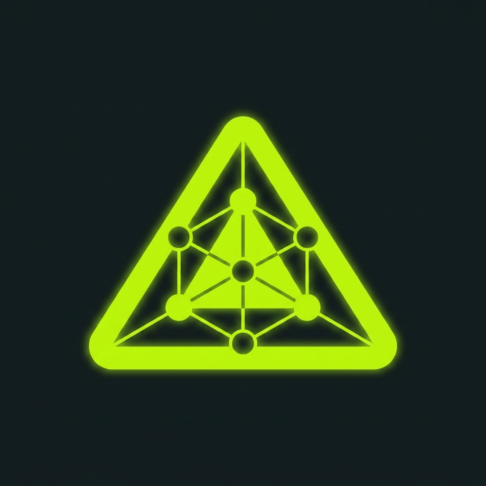

<div align="center">



# AgentLayer Agent Marketplace

**Agentic primitives, identity-aware assistants, and industry-tuned skill packs.**
Curated plugins for [Claude Code](https://docs.claude.com/en/docs/claude-code) and [Codex](https://developers.openai.com/codex), maintained by [AgentLayer](https://agentlayer.one).

[](./LICENSE)
[](https://docs.claude.com/en/docs/claude-code)
[](https://developers.openai.com/codex)

</div>

---

## What's inside

| Plugin | What it does | License |
|---|---|---|
| [`agent-kevin`](https://github.com/AgentLayer1/agent-kevin) | Portable, file-based personal AI assistant. Knowledge pipeline, project lifecycles, daily/weekly/monthly cadences, SEO audit suite. | Apache-2.0 |

More plugins are in the AgentLayer roadmap. Watch this repo or follow [agentlayer.one](https://agentlayer.one) for updates.

One catalog, two hosts: Claude Code reads `.claude-plugin/marketplace.json`, Codex reads `.agents/plugins/marketplace.json`. Both list the same plugins at the same versions.

---

## Install

### Claude Code

From inside any running Claude Code session:

```text
/plugin marketplace add github:AgentLayer1/agentlayer-agent-marketplace
/plugin install agent-kevin@agentlayer
```

> Registered the old `agentlayer-claude-marketplace` repo? Adding this one replaces it, since both carry the marketplace name `agentlayer`, and the plugin id `agent-kevin@agentlayer` is unchanged.

### Codex

From a terminal:

```bash
codex plugin marketplace add AgentLayer1/agentlayer-agent-marketplace
codex plugin add agent-kevin@agentlayer
```

Then launch `codex` from your agent home and run `$upgrade` to wire it; the plugin's README covers the rest.

### Updating

Claude Code:

```text
/plugin marketplace update agentlayer
/plugin update agent-kevin@agentlayer
/reload-plugins
```

Codex:

```bash
codex plugin marketplace upgrade agentlayer
```

### Local development

Each plugin lives in its own repo and carries its own developer marketplace, so you never edit this catalog to work on a plugin:

```bash
git clone https://github.com/AgentLayer1/agent-kevin ~/Developer/agent-kevin
```

Then register the clone itself (`/plugin marketplace add ~/Developer/agent-kevin` and `/plugin install agent-kevin@agentdev-kevin` in Claude Code; `codex plugin marketplace add ~/Developer/agent-kevin` and `codex plugin add agent-kevin@agentdev-kevin` for Codex). The plugin's README has the full developer setup.

---

## What AgentLayer builds

AgentLayer is an enterprise platform for designing, building, and orchestrating AI agent systems across industries. We provide:

1. A **runtime engine** for long-running agent processes (where regulatory boundaries permit).
2. **Agentic primitives**, knowledge pipelines, task systems, dispatch tools, cadence frameworks, that anyone can compose into a working assistant.
3. **Industry-tuned modules** covering fintech, government, healthcare, legal, education, and hospitality, each with built-in human oversight, audit trails, and ASEAN-regional compliance awareness.

This marketplace is how those primitives reach Claude Code and Codex users today, as portable, locally-running plugins. Larger AgentLayer products run elsewhere; everything here is the open-source, single-machine slice.

---

## Roadmap

Plugins AgentLayer is exploring next:

- **agent-mira** (working title): finance-focused assistant, bookkeeping + reconciliation + KYC workflows.
- **agent-jules**: paralegal assistant, statute lookup + case briefing + drafting.
- **agent-luna**: education assistant, lesson planning + curriculum tracking + student feedback synthesis.
- **agent-haven**: hospitality assistant, guest CRM + booking ops + multilingual concierge prompts.

Each will follow the same pattern as Kevin: portable markdown brain, MCP server for tools, hooks for the session lifecycle, opt-in skill packs.

---

## Contributing

We welcome PRs that:

- Register a new plugin in this marketplace catalog (the plugin itself lives in its own repo)
- Improve marketplace metadata or documentation
- Add platform-specific notes (currently macOS-tested; Linux and Windows notes wanted)
- Translate documentation

For improvements to a specific plugin, open the PR against that plugin's own repo. Open an issue here first for architectural changes to the marketplace.

---

## License

This marketplace catalog is licensed under [Apache 2.0](./LICENSE). Each plugin lives in its own repo and carries its own LICENSE/NOTICE; the plugin's repo governs that plugin specifically.

Third-party skill libraries installable via individual plugins (e.g. via `/agent-kevin:configure-skills` → skills.sh) are not bundled here. They install from upstream repos each carrying their own LICENSE.

---

<div align="center">

<a href="https://agentlayer.one"></a>

**Built by [AgentLayer](https://agentlayer.one)** · *agentic infrastructure for AI-native operations*

</div>
